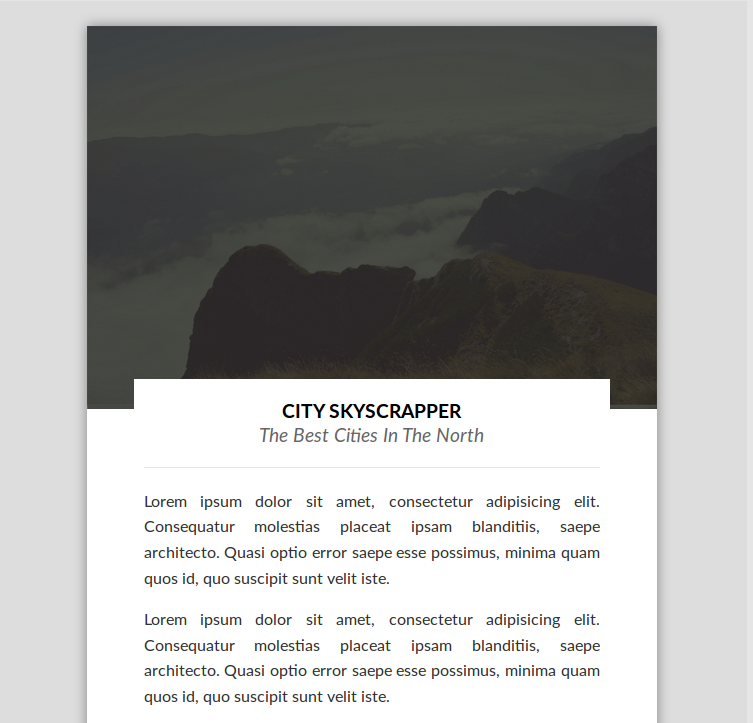
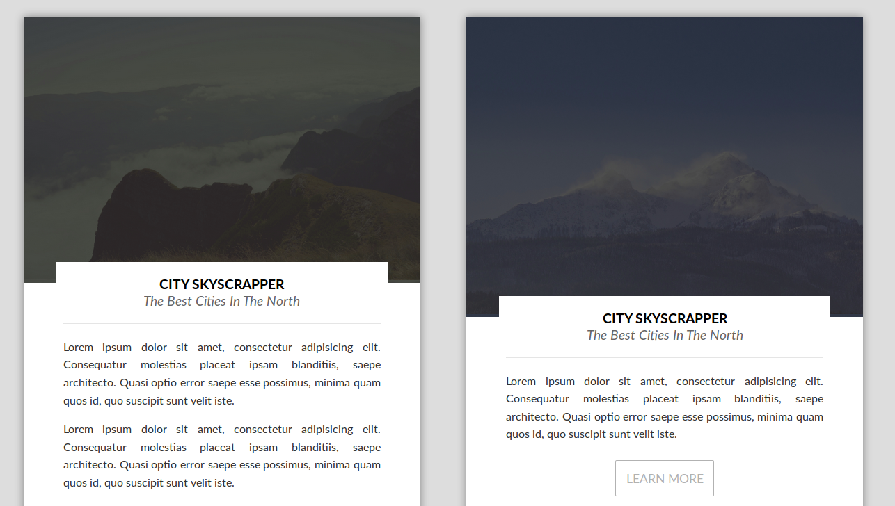
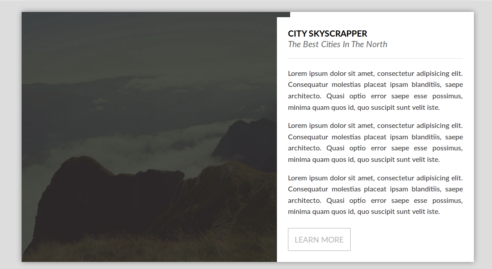

# Cards UI

A simple approach of card UI design.
It was highly inspired by [this article][article].
And when I say highly inspired, I should say that I shamelessly copied the whole design.



## Goal

The idea is to provide a modern responsive card system.
It uses flexbox and css3.



The hack is mainly on the landscape card type.
I use a css background-image with `cover` property.
Sadly, this hack requires a bit of JS to work.
It searches the element and sets a `background-size: cover`. 



Media breakpoints are at:

+ 1170px
+ 1680px

and they are completly arbitrary :).

[article]: https://uxdesign.cc/design-better-cards-c0d12ab58c4

## HTML Structure

the basic Html structure is like the following (using [pug](https://pugjs.org) templating language):


```jade
.card-container
    .card
        .card__image
            img(src="/path/to/my/image.jpg")
        .card__textContent
            .card__title
                .card__title-main
                | The science of Lorem
                .card__title-sub
                | certainly harder than what you think
            .card__content
                p Here lies my text
                p With multiple paragraphs
            .card__button.button Let's Go!
```

(This funny name convention is [BEM](http://getbem.com/)).

## Improvements

It would be nice to get the cards filling completely the space,
especially when they are not the same height.
Flex can oblige the cards to be same height, bringing a problem of button which is really far the bottom.

Currently the problem only appears on screen wider than 1170 but shorter than 1680px.

## Pictures

Pictures are provided freely by [unsplash](https://unsplash.com).
